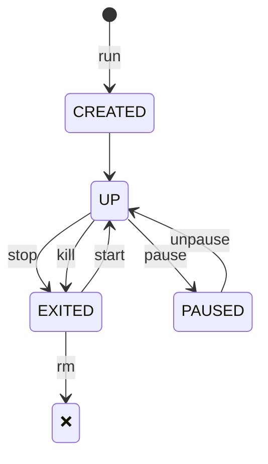

# Interactive Docker

## The Container Lifecycle

### How Containers Live and Die

1. **Birth** (`docker create`)
    - Kernel allocates namespaces
    - Filesystem layers stack up
2. **Life** (`docker start`)
    - Your process (PID 1) runs in isolation
    - All child processes inherit the "walls"
3. **Death** (`docker rm`)
    - Namespaces collapse
    - Ephemeral filesystem evaporates

**Critical Insight**:

> _"Containers are designed to be disposable. Their value lies in their ephemerality - if one breaks, you replace it, not repair it."_

### Lifecycle Management

- Start a new container using the`docker run` command
- Stop and kill the container using the `docker stop` and `docker rm` commands
- Pause and unpause the container using the `docker pause` and `docker unpause` commands

Note:
  `docker container [cmd]` and `docker [cmd]` are doing the same  
