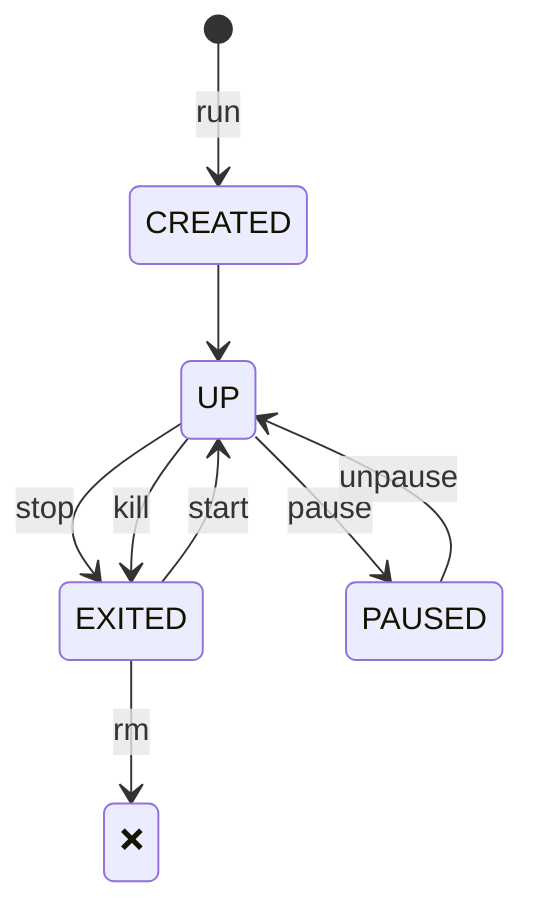

# Interactive Docker

:::warning
This part is not done yet.
:::

## The Container Lifecycle

### How Containers Live and Die

1. **Birth** (`docker create`)
    - Kernel allocates namespaces
    - Filesystem layers stack up
2. **Life** (`docker start`)
    - Your process (PID 1) runs in isolation
    - All child processes inherit the "walls"
3. **Death** (`docker rm`)
    - Namespaces collapse
    - Ephemeral filesystem evaporates

**Critical Insight**:

> _"Containers are designed to be disposable. Their value lies in their ephemerality - if one breaks, you replace it, not repair it."_

### Lifecycle Management

- Start a new container using the`docker run` command
- Stop and kill the container using the `docker stop` and `docker rm` commands
- Pause and unpause the container using the `docker pause` and `docker unpause` commands

Note:
  `docker container [cmd]` and `docker [cmd]` are doing the same  

## Using the Docker CLI

The Docker command is what you will use to interact with the Docker daemon. Using this single executable, you can do the following, and more:

- Start and stop containers
- Pull and push images
- Run a shell in an active container
- Look at container logs
- Create Docker volumes
- Create Docker networks
- Prune old images and volumes
  
This is not meant to include an exhaustive explanation of every Docker command; instead, we will explain some of the common commands that you will need to use to interact with the Docker daemon and containers.

You can break down Docker commands into two categories: general Docker commands and Docker management commands. The standard Docker commands allow you to manage containers, while management commands allow you to manage Docker options such as managing volumes and networking.

### docker help

It is quite common to forget the syntax or options of a command, and Docker acknowledges this. If you ever find yourself in a situation where you can’t recall a command, you can always depend on the docker help command. It will help you by providing what the command can do and how to use it.

### docker run

To run a container, use the docker run command with the provided image name. But, before executing a docker run command, you should understand the options you can supply when starting a container. In its simplest form, an example command you can use to run an NGINX web server would be docker run bitnami/nginx:latest. This will start a container running NGINX, and it will run in the foreground, showing logs of the application running in the container. Pressing Ctrl + C will stop the running container and terminate the NGINX server:

:::warning
This part is not done yet.  
USE OTHER IMAGES
/home/daniel/Downloads/books/Kubernetes_An_Enterprise_Guide_by_Boorshtein_Surovich_24.pdf  
page 49
:::
